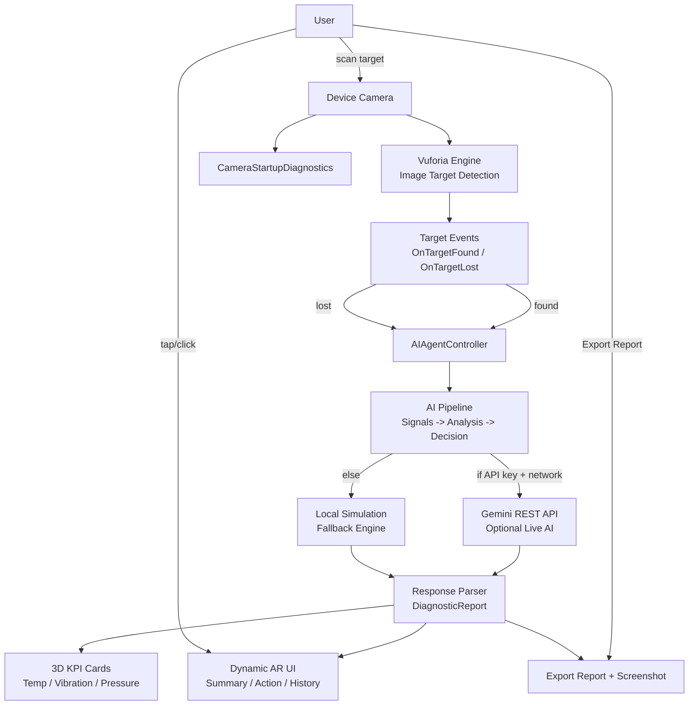

# Modern AR AI App - TP2

## 1) Project Overview
This project is a modern AR + AI mini app built with Unity + Vuforia.
The app detects an image target, launches an AI analysis pipeline, and displays dynamic recommendations in AR.

## Collaborators
- Mohamed Smaoui
- Imran Hajji

## Architecture Diagram

Main use case implemented:
- AR AI Maintenance Assistant
- Target example: Hydraulic Pump P-204
- Output example: Risk level, confidence, findings, recommended action, history panel, exportable report

## 2) Implemented Features
- Vuforia image target detection
- AR content anchored to the detected target
- Real-time event flow:
  - OnTargetFound -> AI analysis starts
  - OnTargetLost -> UI reset
- Multi-panel interactive UI:
  - Summary panel
  - Action panel
  - History panel
- 3D KPI cards around target:
  - Temperature
  - Vibration
  - Pressure
- In-app Export Report button (saves report to persistent storage)
- Automatic screenshot capture when exporting report
- Mini KPI entrance animation on target detection
- Bilingual FR/EN UI mode (switch from Inspector)
- Strong demo-ready visual theme (glass panel + status badge + polished color system)
- Gemini API integration (optional, real AI)
- Local fallback simulation (always available if no key/network)
- Camera startup diagnostics (webcam detection + permission checks)

## 3) Key Scripts
- Assets/AIAgentController.cs
  - Main AR AI logic
  - Gemini call + fallback
  - Dynamic multi-panel UI text
  - 3D KPI cards runtime generation and updates
  - In-app report export logic
- Assets/CameraStartupDiagnostics.cs
  - Camera permission checks
  - Webcam diagnostics
  - Warning when virtual camera is first device

## 4) Gemini API Setup
You can provide your Gemini API key in 2 ways:

### Option A - Inspector (quick test only)
1. Open SampleScene
2. Select ImageTarget
3. In AIAgentController component:
   - useGeminiApi = true
  - geminiApiKey = YOUR_KEY

### Option B - Environment Variable (recommended)
1. Set environment variable GEMINI_API_KEY on your machine
2. In AIAgentController keep:
   - preferEnvironmentApiKey = true

Notes:
- This project is configured with an empty default API key to avoid committing secrets.
- If no key is found, app automatically falls back to local simulation.
- Model can be changed in geminiModel (default: gemini-2.5-flash).
- Before publishing, verify no API key is stored in scene or script files.

## 5) How to Run
1. Open Unity project
2. Open scene: Assets/Scenes/SampleScene.unity
3. Press Play
4. Point camera to image target
5. Observe analysis stages and generated recommendations
6. Observe 3D KPI cards around target updating with risk level
7. Tap/click to cycle panels (Summary -> Action -> History)
8. Click Export Report button to generate local report file (+ screenshot)

### Language Mode
In AIAgentController:
- uiLanguage = French or English

This switches HUD and panel texts for live demo.

## 6) Camera Troubleshooting
If Game view is black:

- Check Console for CameraStartupDiagnostics logs
- If webcam[0] is OBS Virtual Camera:
  - disable OBS Virtual Camera
  - or set physical webcam as default
- Ensure camera permission is allowed (Windows + Android runtime)
- Retry Play mode

Typical error fixed by this project:
- Couldn't config the stream
- Failed to get WebCam image

## 7) Build APK (Android)
### Prerequisites
- Unity Android Build Support installed
- Android SDK/NDK/OpenJDK configured in Unity Hub
- Device in Developer Mode (for direct install)

### Build Steps
1. File -> Build Settings
2. Platform: Android -> Switch Platform
3. Ensure scenes are enabled:
   - Assets/Scenes/SampleScene.unity
   - Assets/SamplesResources/Scenes/0-Main.unity
4. Player Settings:
   - Company Name / Product Name
   - Package Name (unique)
   - Min API level (already configured)
5. Click Build (or Build And Run)
6. Choose output folder (example: Builds/Android)

### APK Location
After build, APK is generated in the folder you selected.
Example:
- Builds/Android/AR_IA_App_TP2.apk

## 8) Extract APK From Existing Build Folder
If you already built before:
1. Open your selected build output directory
2. Search for *.apk
3. Copy the APK to any delivery folder (submission/share)

## 8.1) Where Exported In-App Reports Are Saved
In-app report files are saved to:
- `Application.persistentDataPath/Reports`

On Windows Editor, this typically resolves under:
- `%USERPROFILE%/AppData/LocalLow/<CompanyName>/<ProductName>/Reports`

Each export now produces:
- one `.txt` report
- one `.png` screenshot (same timestamp)

## 8.2) Add More Detectable Images (Vuforia)
To make the app detect additional specific images:
1. Add new images in your Vuforia Target Database
2. Import/update database in Unity
3. Add ImageTarget objects in scene
4. Attach event callbacks to trigger `TriggerAIAnalysis()` and `ResetState()`
5. (Optional) Duplicate/adjust AIAgentController settings per target

Note:
- Current app is optimized for known image targets.
- Detecting arbitrary objects (example: any vegetable) requires a vision object-detection pipeline, not only standard ImageTarget matching.

## 9) What Is Already Ready vs What You Must Do
Already done in code:
- AR AI scenario logic
- Gemini integration + fallback
- Modern dynamic interface behavior
- 3D KPI cards around target
- Export report button inside app
- Auto screenshot bundled with exported report
- KPI card entrance animation
- FR/EN language mode in HUD
- Diagnostics and stability guards

You still need to do manually:
- Ensure physical camera is available/selected
- Build APK from Unity editor

## 10) Next Optional Upgrades
- Add PDF export (currently text export implemented)
- Add language toggle (FR/EN/AR)
- Add remote logging dashboard
- Add screenshot attachment in exported report

## 11) Publish to GitHub (Safe Checklist)
1. Make sure your key is **not** committed:
  - `geminiApiKey` should be empty in scene/script files
  - prefer environment variable `GEMINI_API_KEY`
2. Check git status:
  - `git status`
3. Stage and commit:
  - `git add Assets/AIAgentController.cs Assets/Scenes/SampleScene.unity README.md`
  - `git commit -m "Secure Gemini config, enable tap interaction defaults, update publish docs"`
4. Push to GitHub:
  - `git push origin main`
5. If a key was ever pushed previously, rotate it immediately in Google AI Studio.
